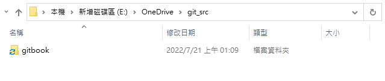

# 安裝Gitbook

## 前置安裝項目

### NodeJS
+ https://nodejs.org/en/

### nvm(主要用來將NodeJS降版本)
+ https://github.com/coreybutler/nvm-windows/releases


### Gitbook(需先安裝完NodeJS)
+ 透過npm指令安裝
  ```
  npm install gitbook-cli -g
  ```

  
  
+ 安裝完畢後檢查版本
  
  ```
  gitbook -V
  ```
  


## Gitbook結構說明

主要有以下三個檔案
+ README.md：gitbook的說明
+ SUMMARY.md：gitbook的目錄結構
+ book.json：gitbook的配置，如：引用plug-in


## 設定本機端Gitbook

+ 挑個好地方建立Gitbook資料夾
  

+ 切到該資料夾，並執行指令
  
  ```
  gitbook init
  ```
  + 執行時會檢查資料夾內是否已有summary.md
    + 無：初始化產生README.md和SUMMARY.md
    + 有：依summary.md內容，初始化檔案(例如：原本沒有AAA.md，但summary.md內有，就會產生AAA.md以滿足目錄結構)

  
  
+ 因為是第一次初始，所以自動產生README.md和SUMMARY.md
    

    
    
+ 設定目錄結構(SUMMARY.md)
  
	```
	 # 目錄
	  
	  * [Introduction](README.md)
	  * [JAVA](articles/JAVA/README.md)
	  * [ios APP](articles/iosAPP/README.md)
	  * [Gitbook](articles/Gitbook/README.md)
	  	* [安裝Gitbook](articles/Gitbook/安裝Gitbook.md)
  ```
  
  
  
+ 再次執行gitbook指令，會自動生成相關檔案

  + 執行前的檔案結構

    

  + 執行gitbook指令

    ```
    gitbook init
    ```

    

  + 執行後

    + 原本已有「articles/Gitbook/安裝Gitbook.md」，所以不會再產生

    + 多出下列三個檔案($\textcolor{red}{各資料夾內的.md不能刪掉，將靜態html上到github時會沒有左側清單}$)

      articles/JAVA/README.md
      articles/iosAPP/README.md
      articles/Gitbook/README.md

    + 重產目錄結構檔

        SUMMARY.md($\textcolor{red}{依原內容重產SUMMARY.md，會將空白符號轉碼；所以筆記檔名最好不要有空格以免超連結跑掉}$)
        
          
    


## 啟動本機端Gitbook

+ 執行以下指令會將所有.md轉為靜態.html放到_book資料夾內，並啟動local sever(可按ctrl+C中斷本機server)

  ```
  gitbook serve
  ```

  

  

+ 啟動完畢後可到 http://localhost:4000 觀看Gitbook；可看到gitbook目錄結構跟summary相同

  

+ `gitbook serve`會同時啟動local sever，若只想將.md轉換為.html，可改執行下面指令

  ```
  gitbook build
  ```

  

  


## 為Gitbook安裝好用的插件

+ 如果想為Gitbook引入一些好用的插件，需自行新增$\textcolor{red}{book.json}$，並設定要引入的插件


+ ​	以下是網路上抄來的設定~並把編輯按鈕導向自己的github XD (來源都放在參考資料內)

   ```json
   {
   	"title": "菜雞的學習筆記",
   	"plugins": [
   		"anchor-navigation-ex",
   		"edit-link",
   		"copy-code-button",
   		"theme-comscore",
   		"ga",
   		"-lunr",
   		"-search",
   		"search-pro",
   		"expandable-chapters",
   		"chapter-fold",
   		"splitter"
   	],
   	"pluginsConfig": {
   		"fontSettings": {
   			"theme": "night",
   			"family": "sans"
   		},
   		"theme-default": {
   			"showLevel": false
   		},
   		"anchor-navigation-ex": {
   			"showLevel": false,
   			"associatedWithSummary": false,
   			"printLog": false,
   			"multipleH1": false,
   			"mode": "float",
   			"showGoTop": true,
   			"float": {
   				"floatIcon": "fa fa-navicon",
   				"showLevelIcon": false,
   				"level1Icon": "fa fa-hand-o-right",
   				"level2Icon": "fa fa-hand-o-right",
   				"level3Icon": "fa fa-hand-o-right"
   			},
   			"pageTop": {
   				"showLevelIcon": false,
   				"level1Icon": "fa fa-hand-o-right",
   				"level2Icon": "fa fa-hand-o-right",
   				"level3Icon": "fa fa-hand-o-right"
   			}
   		},
   		"edit-link": {
   			"base": "https://github.com/YCL72920/gitbook/edit/main/",
   			"label": "編輯"
   		},
   		"ga": {
   			"token": ""
   		}
   	}
   }
   ```

+ 第一次設定完畢要轉換成html時，會告知還沒安裝相關插件

  

+ 照著執行指令先安裝插件

  ```
  gitbook install
  ```

  

+ 安裝完畢後重新轉換.md為.html，並啟動local severt成功

   

+ 可看到加入插件後的效果

   

   


## 參考資料

+ 打造完美写作系统：Gitbook+Github Pages+Github Actions
	https://blog.csdn.net/qq_40889820/article/details/110013310
+ 免費無限建立自己的 GitBook 圖文教學 – 利用 GitHub Pages + GitHub Actions 自動發佈
  https://www.onejar99.com/gitbook-building-and-publishing-free-unlimitedly/

